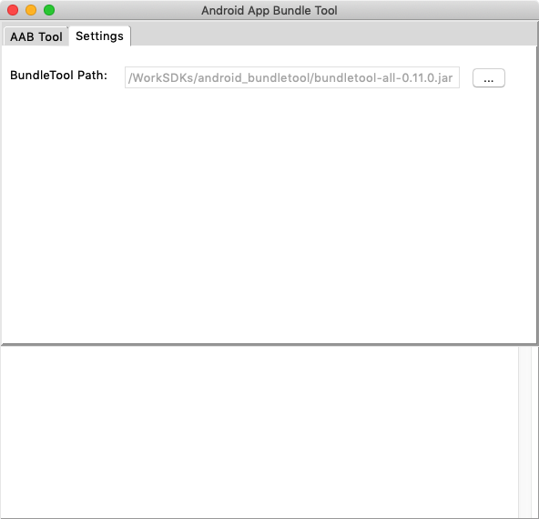
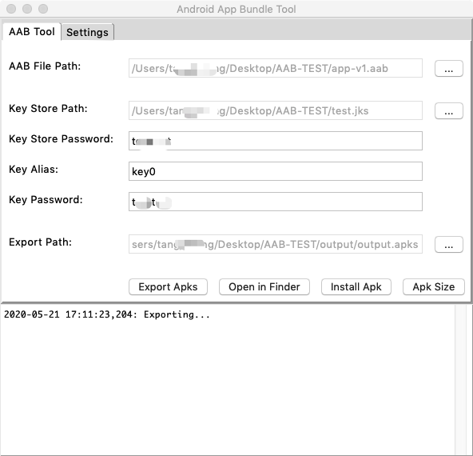

# Android App Bundle Tool For Mac

## System Requirement
* Mac OSX 10.14.+
* Python 2.7
* JDK 1.8+
* Android Studio 3.5+ (optional)

	```
	ADB is required, and Android studio can help you to download Android SDK which contains the adb file.
	```
	

## HOW TO USE
* Download the app form dirctionary [`mapApp/AndroidBundleTool_v1.1`](https://github.com/LazyBonesLZ/AndroidBundleTool/tree/master/macApp/AndroidAppBundleTool_v1.1.zip)
* Download file `bundletool.jar` from [here](https://github.com/google/bundletool/releases), then choose tab `Setting` to set the local path of it.

	
	***Pls note***: if it is the frist time you run this app, Mac OS will show a alert and you need to allow it, see how to deal with this case as follow:
	
	* English: [https://support.apple.com/en-us/HT202491](https://support.apple.com/en-us/HT202491)
	* 中文：[https://support.apple.com/zh-cn/HT202491](https://support.apple.com/zh-cn/HT202491)

* Choose the tab `AAB Tool`, then set all parameters listed on the UI.

	
	
	* Export Apks: output the apks file in the specified directory
	* Open in Finder: open Finder to show output apks file 
	* Install Apk: choose an apks file to install on a device
	* Apk Size: get the min and max size of apk, will show the size information in the console text area.
