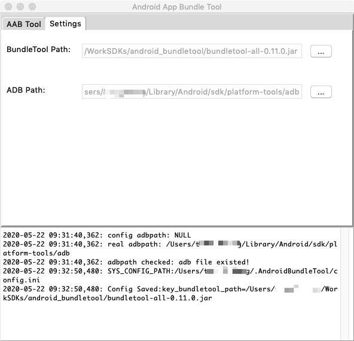
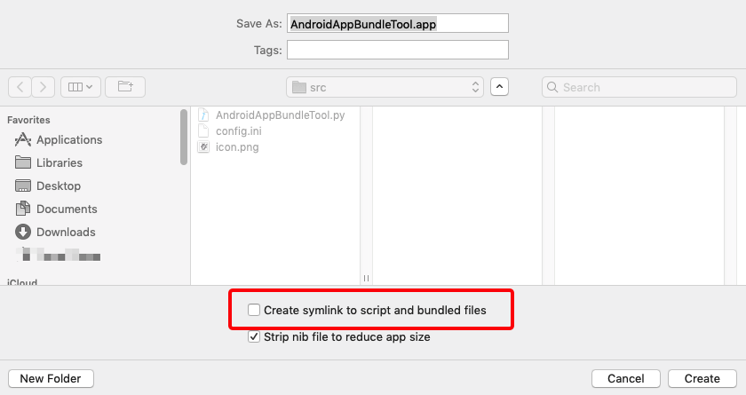

# Android App Bundle Tool For Mac

## System Requirement
* Mac OSX 10.14.+
* Python 2.7
* JDK 1.8+
* Android Studio 3.5+ (optional)

	```
	ADB is required, and Android studio can help you to download Android SDK which contains the adb file.
	```
	

## How to use
* Download the app form dirctionary [`mapApp/AndroidBundleTool_v1.1`](https://github.com/LazyBonesLZ/AndroidBundleTool/tree/master/macApp/AndroidAppBundleTool_v1.1.zip)
* Download file `bundletool.jar` from [here](https://github.com/google/bundletool/releases), then choose tab `Setting` to set the local path of it.

	
	
	***Pls note***: if it is the frist time you run this app, Mac OS will show a alert and you need to allow it, see how to deal with this case as follow:
	
	* English: [https://support.apple.com/en-us/HT202491](https://support.apple.com/en-us/HT202491)
	* 中文：[https://support.apple.com/zh-cn/HT202491](https://support.apple.com/zh-cn/HT202491)

* Choose the tab `AAB Tool`, then set all parameters listed on the UI.

	
	
	* Export Apks: output the apks file in the specified directory
	* Open in Finder: open Finder to show output apks file 
	* Install Apk: choose an apks file to install on a device
	* Apk Size: get the min and max size of apk, will show the size information in the console text area.

## TroubleShot
This is an application based on python 2.7, UI is implemented by Tkinter. I am new to python, so it may not work properly on your mac. If so, it may be because your version does not match. You can modify the source code to be compatible with other versions of the Python interface.

`Platypus` is a script packaging tool. If you complete a new version of the script, you can use this tool to package it into a Mac app. But when packing, you need to pay attention to the following: 

* Script Type : `Python`
* Select your script
* Interface: `None`
* Uncheck the option: `Remain running after execution`
* Add the default config file.

	

* Uncheck the option: `Creat symlink to script and bundled files`

	
